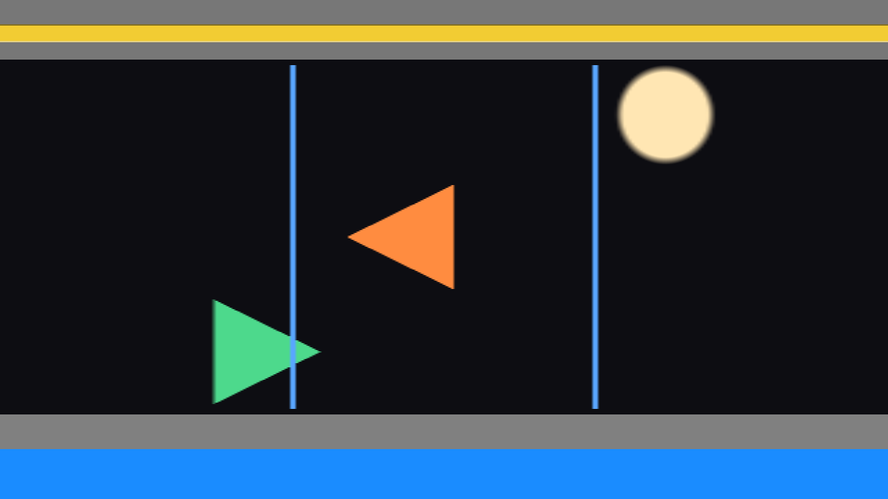
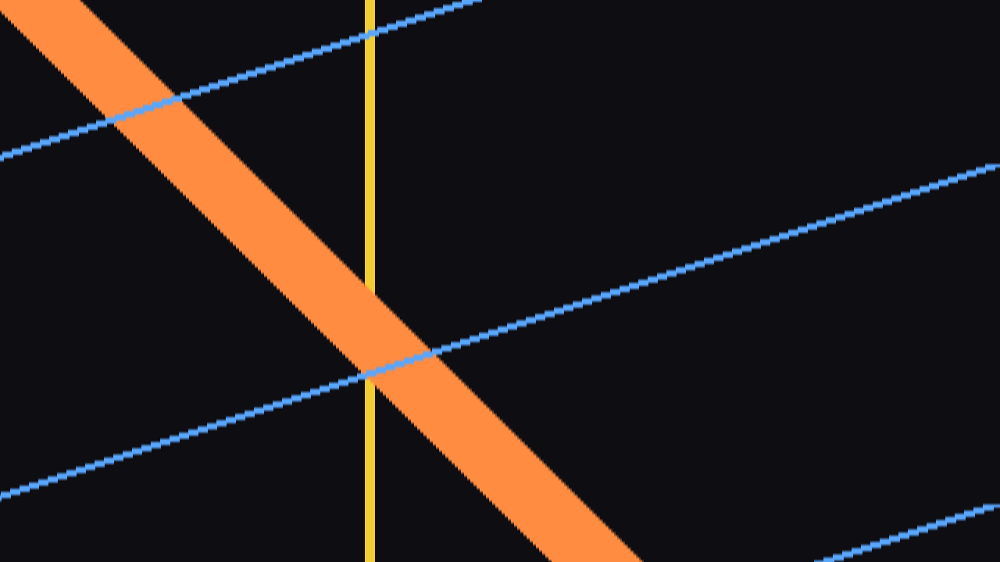

# Photofinish

> **AI-assisted project.** This codebase was created with [Claude](https://claude.com/claude-code)
> (Anthropic), directed and reviewed by a human author. The claims are *measured*, not
> asserted, and each one has a closed form: a moving object's rendered width is checked
> against `b·c/v` to within 0.016 of a column (`pftest --width`); an object crossing at the
> film speed comes out at its own width to within 0.031 of a column at two different
> rasters (`--matched`); a still picture renders as **bitwise** constant streaks over 2.2
> million samples (`--static`); the ring holds the right frames in the right order,
> bitwise, at three rasters (`--ring`); the same take rendered from t=0 and from
> 499,217,238 ms is **bit-identical** (`--clock`); and eight deliberate perturbations of
> the model are asserted to make those checks *fail* (`--negative`). All thirteen controls
> are proven to change the picture (`tools/sweep.py`), and the bundle registers,
> instantiates and renders 120 frames in the fleet's `oxbow` host.
> **It has never been loaded into Resolume.** The last step of proof is a screenshot
> nobody has taken.

A strip camera, for Resolume Arena and Avenue.

A photo-finish camera has no two-dimensional frame. It has **one column of sensor**, and
the film moves past it. So the horizontal axis of the picture is **time, not space** — and
that single substitution produces every artefact the thing is famous for.

The demo card through the plugin, rendered by its own offline harness (`pftest --out`),
not captured from Resolume. Both arrows are the same shape in the source and both cross the
slit at exactly the film speed, so both come out at their true size — but the orange one is
travelling right and comes out <b>mirrored</b>, because its leading point reaches the slit
first and therefore lands at the older end of the strip. The green one is travelling left
and does not. The thin blue lines are a single bar crossing at three times the film
speed, so each crossing is squashed to a third of its width. Everything that was standing still — the
stripes, the colour bar, the diagonal — is a flat horizontal streak, because it is the same
column written over and over.

## What falls out of it

Nothing below is coded anywhere. There is one relation — an object `b` pixels wide crossing
at `v` pixels per frame, photographed at `c` columns per frame, occupies `b·c/v` columns —
and these are that expression at four values of `v`:

- **Anything standing still becomes a horizontal streak.** Same column, over and over.
- **Anything moving is stretched or squashed by 1/its speed.** The slower it crosses the
  slit, the more columns it occupies.
- **Something crossing at exactly the film speed comes out with its true proportions.**
  Which is why the winner looks normal and the crowd behind is smeared.
- **Something crossing the other way comes out reversed.** The famous backwards runner.

Nothing is warped, blurred or time-displaced on purpose. One column is sampled per tick and
pushed onto a ring, and all of the above is what that does.

The one control that looks like an exception is **Slit Width**, and it is not: a slit wider
than one pixel averages the picture *across the direction of travel*, and since the scan
axis is time, that average is over the time an object takes to cross the slit. It is motion
blur in the time axis, arrived at rather than added — and it does nothing at all to the
other axis, which is how you can tell.

## Controls

**Slit** — where the sensor is.

- **Slit Position** — where it sits on the axis it cuts across.
- **Slit Width** — 1 to 64 source pixels. See above: this is exposure time, not blur.
- **Slit Angle** — lean the slit. A slope, ±45° in normalised picture space.
- **Axis** — Horizontal (the slit is a vertical line, time runs across) or Vertical (the
  slit is a horizontal line, time runs down).
- **Direction** — which end of the scan axis is the newest column. This is what decides
  which way of travelling comes out mirrored.

**Time** — how fast the film runs.

- **Time Per Column** — 0.5 ms to 500 ms. The film speed, and the only rate in the plugin.
  Below a frame period the intervening columns are built from the two frames either side.
- **Sweep Length** — how many columns the strip holds, from 8 to the full axis. Shorter is
  magnified to fill, in blocks: a column is one instant and a blend of two of them is a
  moment nobody photographed.
- **Sync** — Free, Beat or Bar. On Beat or Bar the column period is derived from the host's
  tempo so one whole sweep is one beat or one bar, and Time Per Column is ignored.
- **Interpolate** — Nearest or Linear, for the columns that fall between two frames.

**Output**

- **Fill** — Build (the head marches across and wraps, writing in place, with a moving seam
  where newest meets oldest), Scroll (the newest column stays at one edge and the picture
  slides), or Once (fill and hold).
- **Background** — what an unwritten column shows: Black, the live clip, or transparent.
- **Mix** — crossfade with the untouched clip.
- **Freeze** — stop the film.

The same card with **Axis** set to Vertical. Now the slit is a horizontal line across
the source and time runs downwards, so the roles of the two axes swap: the static diagonal
becomes a vertical streak, and the things that were moving draw diagonal traces whose slope
is their speed.

## Status

**v0.1.0, 2026-09-22, and honestly early.**

- **It has never been loaded into Resolume**, and is not installed anywhere. Everything
  here was compiled, rendered and measured offline against the real plugin class in a
  headless GL context, plus one load in the fleet's own [oxbow](https://github.com/stoatworks-labs/oxbow)
  host, which confirms it registers, instantiates and renders as `SW Photofinish` / `PF01`
  / effect.
- 84 assertions across eleven check suites, all passing (`tools/verify.sh`, ~15 s). Every
  tolerance is derived from a lattice — one column, one source frame, one 8-bit code value
  — rather than fitted to a rendered number, and eight negative controls prove the checks
  can fail. The audit of every one of them is in `AGENTS.md`.
- Measured on macOS (Apple Silicon) only: **0.17 ms/frame at 720p, 0.27 at 1080p, 0.96 at
  4K** — and 0.20 / 0.29 / 1.03 at the fastest column rate, which is thirty-three one-pixel
  draws a frame instead of four. Never run on Windows, on Intel, or on a rasteriser without
  a GPU behind it.
- **Sync sets a rate, not a phase.** One sweep takes one bar, but the sweep is not aligned
  to the bar *line* — locking the write head to the host's bar phase would make it jump on
  a tempo change or a scrub, which tears the strip. That is the obvious v0.2.
- **Sub-frame columns are interpolated between the frames the host delivered**, and that
  has an honest limit: anything crossing the slit in less than one host frame was never
  over the slit in a frame the plugin was given, and no interpolation recovers it. FFGL has
  no way to ask for a frame it was not handed.
- No factory presets. No OpenFX port, no browser demo — neither is required for 0.1.0.
- `StoatworksAbout*.h` and `ATTRIBUTIONS.md` are provisional hand copies; the project is
  not registered in the fleet's backend yet, so there is no user guide and no button that
  would open one.

## Installing

Copy `Photofinish.bundle` (macOS) or `Photofinish.dll` (Windows) into

    ~/Documents/Resolume Arena/Extra Effects        (or "Resolume Avenue")
    Documents\Resolume Arena\Extra Effects           (Windows)

and restart Resolume. It appears under **Effects** as **SW Photofinish**.

## Building

    git clone --recursive https://github.com/stoatworks-labs/photofinish
    cmake -B build -DCMAKE_BUILD_TYPE=Release
    cmake --build build --parallel
    cmake --install build          # into Arena's Extra Effects, macOS

C++17 + GLSL 4.10, CMake, FFGL 2.1 (SDK vendored as a submodule, pinned to `b1afaf9`). The
macOS build is universal (arm64 + x86_64) by default; add `-DCMAKE_OSX_ARCHITECTURES=arm64`
for a faster development build. Windows needs GLEW from vcpkg — see
`.github/workflows/release.yml` for the exact configure line.

## Building and testing

The offline harness renders the real plugin class headlessly and measures it:

    ./build/pftest --out /tmp/f.png --size 1920x1080 --frames 340   # the demo card, as a strip
    ./build/pftest --list                                           # every control and its range
    ./build/pftest --schedule                                       # when a column is taken; no GL at all
    ./build/pftest --static --ring --clock                          # three bitwise claims
    ./build/pftest --width --matched --reverse --sync                # the closed forms
    ./build/pftest --negative                                       # those checks, perturbed, must fail
    ./build/pftest --bench --frames 200                             # 720p through 4K
    python3 tools/sweep.py                                          # no control is silently dead
    tools/verify.sh                                                 # all of it, on a fresh universal build

`tools/verify.sh` does the release job's work locally — universal build, `lipo`, the plist,
the exact `codesign` the release runs, and a real host load — because a check that only runs
in CI after a tag is a check that will catch you after the tag.

## Diagnostics

Photofinish writes a plain-text log every time it runs:

    ~/Library/Logs/photofinish/photofinish.YYYY-MM-DD.log                     (macOS)
    %LOCALAPPDATA%\photofinish\logs\photofinish.YYYY-MM-DD.log                (Windows)

It records the build, the GL driver, any shader that would not compile, what unit the host's
clock turned out to be in, and the ring's shape whenever it is rebuilt. The last two are
invisible from the picture and both change what every column means. If you are filing a bug,
this is the single most useful thing to attach.

## Licence

MIT. See [LICENSE](LICENSE) and [ATTRIBUTIONS.md](ATTRIBUTIONS.md).
